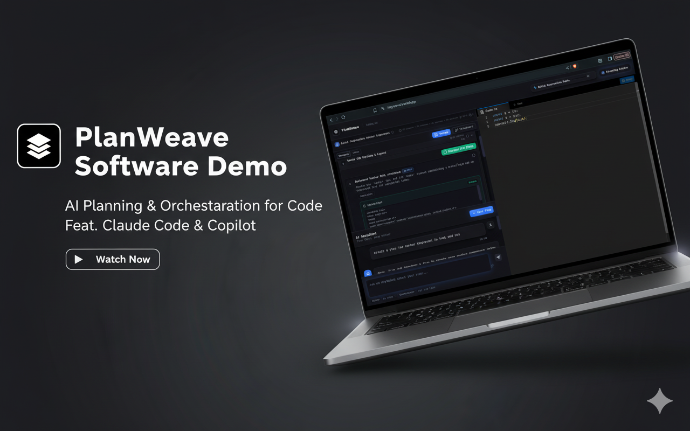
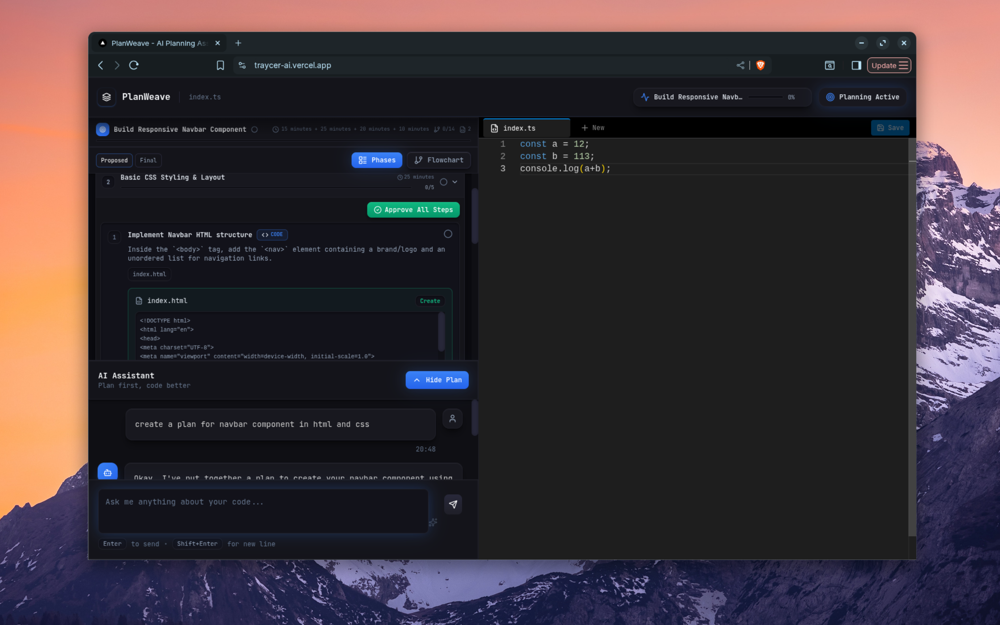

# PlanWeave AI

<div align="center">



**An intelligent planning layer for your IDE that converts natural language requests into structured development plans**

[](https://nextjs.org/)
[](https://www.typescriptlang.org/)
[](https://www.langchain.com/)
[](https://deepmind.google/technologies/gemini/)

[Features](#features) • [Demo](#demo) • [Installation](#installation) • [Usage](#usage) • [Architecture](#architecture) • [Contributing](#contributing)

</div>

---

## Overview

PlanWeave AI is a **developer-focused assistant** for structured planning within an IDE. It generates **phase-based execution plans** from natural language requests, retrieves context from your codebase, and produces actionable steps with code suggestions.

**Key Capabilities:**

* Context-aware plan generation from existing code
* Phase-based, structured development steps
* Interactive plan review with approvals, edits, or skips
* Flowchart and timeline visualizations
* RAG-powered code understanding for accurate AI suggestions

---

## Features

### Conversational Interface

* Natural language interaction
* Streaming, code-aware responses
* Context-sensitive suggestions from your workspace

### Plan Generation

* Detects development intent via keywords (`build`, `create`, `implement`)
* Phase-based structure with detailed steps:

  * Action descriptions
  * Files affected
  * Step type: code, file, command, review, test
  * Code snippets
  * Time estimates

### Visualization

* **Timeline View** – Linear, step-by-step breakdown
* **Flowchart View** – Node-based interactive visualization
* Toggle between proposed and approved plans

### RAG-Powered Context

* Semantic search on project files
* Automatic indexing on file changes
* Retrieves relevant code snippets for plan generation

### Agent-Friendly Output

* Generates execution-ready markdown plans
* Optimized for AI coding agents
* Options to copy, download, or execute directly

---

## Demo

### Video & Screenshots

* Demo Video: [YouTube](https://youtu.be/Xa32hMJkoUU?si=WzqsxPpvi0TtCaTC)
* Plan Visualization:
  

---

## Installation

### Prerequisites

* Node.js 18+ and npm/yarn/pnpm
* Google API Key (for Gemini models)

### Setup

```bash
git clone https://github.com/zunxii/planweave-ai.git
cd planweave-ai
npm install          # or yarn install / pnpm install
cp .env.example .env.local
```

Add your Google API key in `.env.local`:

```env
GOOGLE_API_KEY=your_google_api_key_here
NODE_ENV=development
```

Run the dev server:

```bash
npm run dev  # or yarn dev / pnpm dev
```

Open [http://localhost:3000](http://localhost:3000)

---

## Usage

1. **Add Files** – Create or open files in the Monaco editor; they are indexed automatically.
2. **Chat with AI** – Ask code questions, request explanations, or improvements.
3. **Generate Plan** – Use commands like `"Build a feature..."` or `"Implement API..."`.
4. **Review Plan** – Approve, edit, skip, or preview generated steps.
5. **Complete Plan** – Export execution-ready markdown or apply code directly.

**Example Commands:**

```
Explain what this component does
Add error handling to login
Build a real-time chat feature
Create a REST API for user management
Implement dark mode toggle
```

---

## Architecture

### Tech Stack

**Frontend**

* Next.js 15.5, TypeScript, Tailwind CSS
* Monaco Editor for code editing
* React Flow for flowchart visualization
* Zustand for state management

**Backend / AI**

* LangChain orchestration
* Google Gemini 2.x for chat and plan generation
* VectorStore for RAG-based code context

**Key Libraries**

* `@langchain/google-genai`, `zustand`, `@monaco-editor/react`, `reactflow`, `nanoid`, `lucide-react`

---

### Project Structure (Simplified)

```
app/             # Next.js pages and API routes
components/      # Editor, chat, canvas, flowchart, UI
features/        # Logic modules for chat, editor, plans, flowchart
services/        # AI services, LangChain integration
store/           # Zustand slices
types/           # TypeScript types
hooks/           # Custom hooks
lib/             # Utilities
public/          # Static assets
docs/            # Documentation and screenshots
```

---

### Data Flow

```
User input → Chat API → Context retrieval → LLM processing → Plan generation → Store update → UI render
```

---

### Plan Structure

```typescript
ExecutionPlan
├── id, title, description, status, progress
├── metadata: { totalSteps, completedSteps, filesAffected }
└── phases: PlanPhase[]
    ├── id, label, description, status, order
    └── steps: PlanStep[]
        ├── id, label, description, status
        ├── type: 'code' | 'file' | 'command' | 'review' | 'test'
        ├── files: string[]
        └── codeChanges: { file, language, changeType, content, applied }
```

---

## Contributing

1. Fork the repository
2. Create a feature branch
3. Commit changes with descriptive messages
4. Push branch and open a Pull Request
5. Follow TypeScript and project structure conventions

---

## License

MIT License - see [LICENSE](LICENSE)

---

## Contact

* GitHub: [@zunxii](https://github.com/zunxii)
* Project: [https://github.com/zunxii/planweave-ai](https://github.com/zunxii/planweave-ai)

---

✅ **Star the repo if you find it useful!**

---


